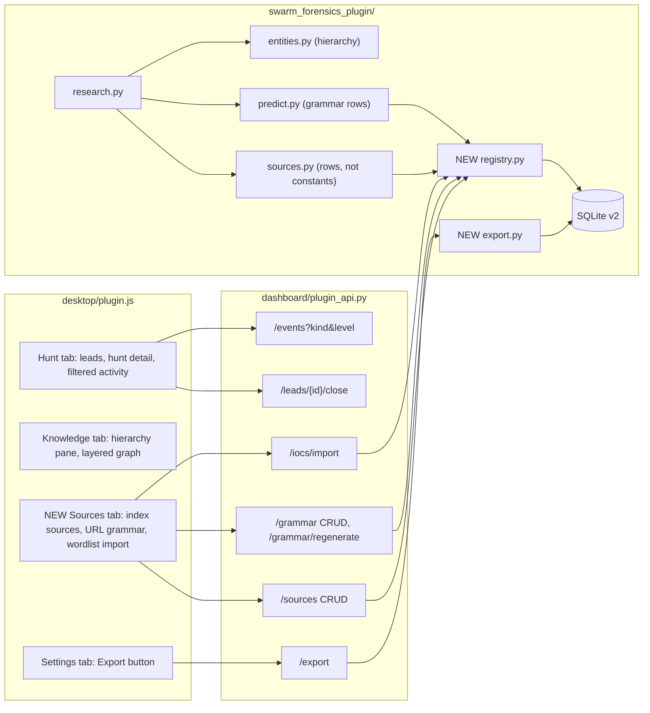

# Extend the Swarm Forensics desktop plugin

This plan extends the existing `plugins/swarm-forensics` Hermes plugin. It does not rewrite it. The work covers three areas:

1. **UI fixes:** wasted requests, graph stability, and the `Error` name clash.
2. **New operator features:**
   - leads panel
   - hunt detail view
   - activity filters
   - export
3. **Model changes:**
   - index sources, URL grammar, and wordlists move into the database, editable from the UI
   - the entity hierarchy becomes `artifact → agent → swarm → campaign`

All work stays inside `pug-research/hermes-plugin/`. The nearest blackboard is [MODULE.md](file:///mnt/c/Users/chris/Desktop/projects/swarm-forensics/pug-research/hermes-plugin/MODULE.md).

---

## User Review Required

> [!IMPORTANT]
> **Two invariants change.** Per AGENTS.md §3.4, I am proposing these changes before I implement them.
>
> **Invariant 16 (current):** "Index adapters MUST fetch only allowlisted hosts (`urlquery.net`, `web.archive.org`, `arquivo.pt`) through `curl`."
> **Invariant 16 (proposed):** "Index adapters MUST fetch only hosts of enabled rows in `index_sources`, through `curl`. Only an operator act adds, edits, or enables a row. A row MUST use `https`, a public host (`validate_url`), and a known adapter kind (`cdx`, `urlquery`). Every change writes a `registry` event. Open-web search and page reads MUST go through Hermes tools."
>
> **Intent and scope (§1):** "an entity graph (agents, swarms, cases)" becomes "an entity graph (artifacts, agents, swarms, campaigns, and loose collections)."
>
> **New invariant:** "Hierarchy links (`part_of`) are stored child → parent along `artifact < agent < swarm < campaign`. A link given in the wrong direction is flipped, not refused. `collection` sits outside the hierarchy and MAY link to any type."

> [!WARNING]
> **Schema migration v2 rebuilds the `entities` table.** SQLite cannot change a `CHECK` constraint in place. `migrate()` must turn foreign keys off while it rebuilds the table. Otherwise `DROP TABLE` would cascade-delete every link, indicator, and evidence join. After the copy, the migration runs `PRAGMA foreign_key_check`. On any violation, the migration rolls back. The migration renames data in place:
> - `trace` → `artifact`
> - `case` → `campaign`
> - link kinds `member_of` and `trace_of` → `part_of`
>
> **Back up `<hermes home>/swarm-forensics/swarm-forensics.db` before installing.** The migration copies the file to `swarm-forensics.db.v1.bak` before it runs.

> [!NOTE]
> **Hierarchy semantics, from your answer.** One stored link `artifact ─part_of→ agent` reads both ways:
> - On the agent page, it shows as **Artifacts (n)**.
> - On the artifact page, it shows as **Belongs to: agent X**.
>
> The plan does not block any link. It only normalizes the direction, so queries and the layered graph stay consistent.

---

## Open Questions (defaults in effect)

The operator has not answered these yet. Use the defaults. Change them only on operator instruction.

1. **Export destination.** Write to `<state dir>/exports/<UTC stamp>/`. Show the path in a toast. No SDK download API is known.
2. **urlquery.** Seed the `urlquery` row as **disabled**, with the note "endpoint returns 404 (2026-10-04)". Do not delete it.
3. **Wordlist import status.** Imported terms default to `proposed`. An "activate now" checkbox accepts them at once.

---

## Architecture after the change



---

## Proposed Changes

### 1. Storage: schema v2

#### [MODIFY] [db.py](file:///mnt/c/Users/chris/Desktop/projects/swarm-forensics/pug-research/hermes-plugin/plugins/swarm-forensics/swarm_forensics_plugin/db.py)

- Change `migrate(conn)` as follows:
  - Run `PRAGMA foreign_keys = OFF` before the loop.
  - Run `PRAGMA foreign_key_check` after each step. Raise and roll back on any row.
  - Restore `foreign_keys = ON` in `finally`.
- In `Database.__init__`, copy the file to `<db>.v1.bak` once, when `user_version` is 1 and v2 is pending.
- Append migration 2:

```sql
-- 2a. Entities: new type set. Rebuild because CHECK cannot be altered.
CREATE TABLE entities_v2(
    id TEXT PRIMARY KEY,
    type TEXT NOT NULL
        CHECK(type IN ('artifact','agent','swarm','campaign','collection')),
    name TEXT NOT NULL COLLATE NOCASE,
    summary TEXT NOT NULL DEFAULT '', notes TEXT NOT NULL DEFAULT '',
    attrs TEXT NOT NULL DEFAULT '{}', origin TEXT NOT NULL DEFAULT 'human',
    created_utc TEXT NOT NULL, updated_utc TEXT NOT NULL,
    UNIQUE(type, name));
INSERT INTO entities_v2 SELECT id,
    CASE type WHEN 'trace' THEN 'artifact' WHEN 'case' THEN 'campaign' ELSE type END,
    name, summary, notes, attrs, origin, created_utc, updated_utc FROM entities;
DROP TABLE entities;
ALTER TABLE entities_v2 RENAME TO entities;

-- 2b. Links: one hierarchy kind.
UPDATE OR IGNORE links SET kind = 'part_of' WHERE kind IN ('member_of','trace_of');
DELETE FROM links WHERE kind IN ('member_of','trace_of');   -- duplicates of an existing part_of

-- 2c. Operator-editable registries.
CREATE TABLE index_sources(
    id INTEGER PRIMARY KEY AUTOINCREMENT,
    name TEXT NOT NULL UNIQUE,
    kind TEXT NOT NULL CHECK(kind IN ('cdx','urlquery')),
    endpoint TEXT NOT NULL,
    config TEXT NOT NULL DEFAULT '{}',      -- e.g. {"filter_field":"urlkey","nonce_prefix":"r.jina.ai/http*"}
    enabled INTEGER NOT NULL DEFAULT 0,
    probe_candidates INTEGER NOT NULL DEFAULT 0,
    origin TEXT NOT NULL DEFAULT 'human',
    note TEXT NOT NULL DEFAULT '',
    created_utc TEXT NOT NULL, updated_utc TEXT NOT NULL);
CREATE TABLE url_grammar(
    id INTEGER PRIMARY KEY AUTOINCREMENT,
    kind TEXT NOT NULL CHECK(kind IN ('pattern','relay','nonce_probe','jq_probe','target')),
    value TEXT NOT NULL,
    param TEXT NOT NULL DEFAULT '',         -- nonce param name, or relay style ('query'|'path')
    enabled INTEGER NOT NULL DEFAULT 1,
    origin TEXT NOT NULL DEFAULT 'human',
    note TEXT NOT NULL DEFAULT '',
    created_utc TEXT NOT NULL,
    UNIQUE(kind, value, param));
```

Seed rows are inserted in Python right after the SQL step, so the defaults live in one place (`registry.DEFAULT_*`):

- `cdx` (web.archive.org): enabled, and the candidate prober.
- `arquivo`: enabled.
- `urlquery`: disabled, with a note.
- All current `OBSERVED_URL_PATTERNS`, `RELAYS`, `NONCE_PROBES`, `JQ_PROBES`, and `EXTRA_TARGETS`, as `origin='seed'`.

#### [MODIFY] [settings.py](file:///mnt/c/Users/chris/Desktop/projects/swarm-forensics/pug-research/hermes-plugin/plugins/swarm-forensics/swarm_forensics_plugin/settings.py)

- Change `hunt.sources` choices from `["web","urlquery","cdx","arquivo"]` to `["web","index"]`, with default `["web","index"]`. The `index` toggle covers every enabled `index_sources` row.
- `_coerce` maps a legacy stored value: any of `urlquery/cdx/arquivo` → `index`. A saved choice survives the upgrade.
- Rename the `graph.auto_entities` label to "Write artifacts, agents, swarms, and campaigns to the graph".

---

### 2. Registries: sources, grammar, wordlists

#### [NEW] registry.py

One module owns both tables. All SQL is parameterized.

```python
ADAPTER_KINDS = ("cdx", "urlquery")
GRAMMAR_KINDS = ("pattern", "relay", "nonce_probe", "jq_probe", "target")

class RegistryError(ValueError): ...

class Registry:
    def __init__(self, database, ledger): ...
    # index sources
    def sources(self, enabled_only=False) -> list[dict]
    def add_source(self, name, kind, endpoint, config=None, note="") -> dict
    def update_source(self, sid, **fields) -> dict      # enabled, endpoint, config, note, probe_candidates
    def delete_source(self, sid) -> bool
    def allowed_hosts(self) -> set[str]                 # hosts of enabled rows
    # URL grammar
    def grammar(self, kind=None) -> list[dict]
    def add_grammar(self, kind, value, param="", note="") -> dict
    def set_grammar_enabled(self, gid, enabled) -> dict
    def delete_grammar(self, gid) -> bool
    def grammar_bundle(self) -> dict                    # enabled rows grouped for predict.py
    # wordlists
    def import_wordlist(self, text, iocs, activate=False) -> dict  # {added, skipped, refused}
```

Validation:

- `endpoint` MUST pass `safety.validate_url`, use `https`, and have a path.
- `kind` MUST be in `ADAPTER_KINDS`.
- `config` accepts only the known keys `filter_field` and `nonce_prefix`.
- A `relay`'s `value` MUST pass `validate_url`. Grammar rows are never fetched, so patterns need only a length cap (600) and a `{slot}` syntax check.
- `import_wordlist` reads one line at a time, with a 5000-line cap.
  - `# SECTION` headers become the category (the same format as `seeds/wordlist-seed.txt`).
  - Each term goes through `iocs.propose(..., provenance="import", actor="human")`. Exclusion terms and the term regex still apply.
- Every write calls `ledger.event(None, "registry", "...")`. This gives an audit trail.

#### [MODIFY] [sources.py](file:///mnt/c/Users/chris/Desktop/projects/swarm-forensics/pug-research/hermes-plugin/plugins/swarm-forensics/swarm_forensics_plugin/sources.py)

- Remove `ALLOWLIST`, `URLQUERY_SEARCH`, `CDX_SEARCH`, `ARQUIVO_CDX`, and `INDEX_SOURCES`.
- `IndexSources(..., allowed_hosts)`. `curl_get(url, ua, params, allowed_hosts)` refuses any host outside the set. This keeps the check at the network edge.
- `queries_for(source_row, terms, cursor)` switches on `row["kind"]` and reads `endpoint`, `config.filter_field`, and `config.nonce_prefix`.
- `candidate_query(url, source_row)` uses the row flagged `probe_candidates`.

#### [MODIFY] [predict.py](file:///mnt/c/Users/chris/Desktop/projects/swarm-forensics/pug-research/hermes-plugin/plugins/swarm-forensics/swarm_forensics_plugin/predict.py)

- Move the constants into `DEFAULT_GRAMMAR`, which is used only to seed the table.
- `generate_candidates(bundle)` and `matches_observed(url, patterns)` take the enabled grammar rows. The generation logic itself does not change.
- A test checks that the seeded bundle produces the same candidates as today.

#### [MODIFY] [iocs.py](file:///mnt/c/Users/chris/Desktop/projects/swarm-forensics/pug-research/hermes-plugin/plugins/swarm-forensics/swarm_forensics_plugin/iocs.py)

- Move the line parser from `seed()` into a shared `parse_wordlist(lines)` generator. `seed()` and `Registry.import_wordlist` both use it.

---

### 3. Entity hierarchy

#### [MODIFY] [safety.py](file:///mnt/c/Users/chris/Desktop/projects/swarm-forensics/pug-research/hermes-plugin/plugins/swarm-forensics/swarm_forensics_plugin/safety.py)

```python
ENTITY_TYPES = ("artifact", "agent", "swarm", "campaign", "collection")
HIERARCHY = ("artifact", "agent", "swarm", "campaign")      # child -> parent order
LINK_KINDS = ("part_of", "related", "observed_with")
LEGACY_TYPES = {"trace": "artifact", "case": "campaign"}
LEGACY_LINKS = {"member_of": "part_of", "trace_of": "part_of"}
```

- `parse_analysis` reads `campaigns` (and `cases` as an alias).
- It maps legacy types and kinds through the tables above, so older model habits still parse.

#### [MODIFY] [entities.py](file:///mnt/c/Users/chris/Desktop/projects/swarm-forensics/pug-research/hermes-plugin/plugins/swarm-forensics/swarm_forensics_plugin/entities.py)

- `link(src, dst, kind)`: for `part_of` between two hierarchy types, if `rank(src) > rank(dst)`, swap the ends. Same-type `part_of` becomes `related`.
- `view(eid)` adds two lists, `parents` and `children`. Each one groups the `part_of` edges by the other end's type, for example `{"artifact": [...], "swarm": [...]}`. `outgoing` and `backlinks` stay for the other kinds.
- `graph()` adds `rank` to each node (0–3, or `null` for a collection).

#### [MODIFY] [prompts.py](file:///mnt/c/Users/chris/Desktop/projects/swarm-forensics/pug-research/hermes-plugin/plugins/swarm-forensics/swarm_forensics_plugin/prompts.py)

- The analysis schema becomes `agents / swarms / campaigns`, and `links.kind` becomes `part_of|related|observed_with`.
- Add one rule: "An artifact is part of the agent that produced it. An agent is part of a swarm. A swarm is part of a campaign."

#### [MODIFY] [research.py](file:///mnt/c/Users/chris/Desktop/projects/swarm-forensics/pug-research/hermes-plugin/plugins/swarm-forensics/swarm_forensics_plugin/research.py)

- `_apply`:
  - Create `agent`, `swarm`, and `campaign` entities from the analysis.
  - The page entity is now an `artifact`, not a `trace`.
  - Link the artifact `part_of` each agent. If there are no agents, link it to each swarm.
- `_sweep`:
  - Loop over `registry.sources(enabled_only=True)` when `"index" in hunt.sources`.
  - The per-source cursor key becomes `src:<id>`.
  - Probe candidates through the `probe_candidates` row.
- `run_cycle`: when the grammar changes, `/grammar/regenerate` adds new candidates with `INSERT OR IGNORE`. The run no longer seeds candidates only when the table is empty.
- `Parts` gains `registry`.

#### [MODIFY] [service.py](file:///mnt/c/Users/chris/Desktop/projects/swarm-forensics/pug-research/hermes-plugin/plugins/swarm-forensics/swarm_forensics_plugin/service.py)

- Build `Registry` and pass it into `Parts`.

---

### 4. Ledger and export

#### [MODIFY] [ledger.py](file:///mnt/c/Users/chris/Desktop/projects/swarm-forensics/pug-research/hermes-plugin/plugins/swarm-forensics/swarm_forensics_plugin/ledger.py)

- `events(hunt_id=None, after_id=0, limit=200, kind=None, level=None)`.
- `close_lead(lead_id, status)` accepts `done` or `dismissed`, and returns `bool`.

#### [NEW] export.py

`export_all(service, dest_root) -> {"path", "counts"}` writes `dest_root/<YYYYmmddTHHMMSSZ>/`. The file is written one row at a time, so it never holds the full dataset in memory:

```
swarm-forensics.json        # {"schema": 2, "exported_utc", "iocs": [...], "entities": [...],
                            #  "links": [...], "evidence": [...], "hunts": [...]}
vault/
  Artifacts/<name>.md
  Agents/<name>.md
  Swarms/<name>.md
  Campaigns/<name>.md
  Collections/<name>.md
  IOCs.md                   # grouped by status, with audit trail
```

Each note looks like this:

```markdown
---
type: agent
origin: model
updated: 2026-10-04T06:00:00+00:00
---
# Alpha
> one-line summary

## Belongs to
- [[Swarm Beta]]
## Artifacts
- [[r.jina.ai relay page]]
## Related
- [[Gamma]] (observed_with)

<operator notes, verbatim; existing [[wikilinks]] keep working>

## Evidence
- [L3] https://example.test/p — 2026-10-03
```

- File names are sanitized: no `/\:*?"<>|`, at most 120 characters, and a numeric suffix on collision.
- The destination is `paths.state_dir() / "exports"`, so no export ever lands in the plugin directory.

---

### 5. Backend routes

#### [MODIFY] [plugin_api.py](file:///mnt/c/Users/chris/Desktop/projects/swarm-forensics/pug-research/hermes-plugin/plugins/swarm-forensics/dashboard/plugin_api.py)

| Method | Path | Body / query | Notes |
|---|---|---|---|
| GET | `/events` | `+ kind, level` | filters |
| POST | `/leads/{id}/close` | `{status: "dismissed"\|"done"}` | 404 if missing |
| GET | `/sources` | | all rows |
| POST | `/sources` | `{name, kind, endpoint, config?, note?}` | 400 on validation |
| PUT | `/sources/{id}` | `{enabled?, endpoint?, config?, note?, probe_candidates?}` | |
| DELETE | `/sources/{id}` | | |
| GET | `/grammar` | `?kind=` | |
| POST | `/grammar` | `{kind, value, param?, note?}` | |
| PUT | `/grammar/{id}` | `{enabled}` | |
| DELETE | `/grammar/{id}` | | |
| POST | `/grammar/regenerate` | | `{added}` new candidates |
| POST | `/iocs/import` | `{text, activate}` | `{added, skipped, refused}` |
| POST | `/export` | `{}` | `{path, counts}` |

`_run` also maps `RegistryError` → 400.

---

### 6. Desktop UI

#### [MODIFY] [plugin.js](file:///mnt/c/Users/chris/Desktop/projects/swarm-forensics/pug-research/hermes-plugin/plugins/swarm-forensics/desktop/plugin.js)

**Fixes**
- `useApi(key, path, poll, enabled = true)` passes `enabled` to `useQuery`.
  - `IocRow` fetches detail only while the row is open.
  - `EvidencePage` fetches detail only while a row is open. This removes the fake `/status` fallback.
- Rename `Error` → `ErrorNote`, and update all call sites.
- `GraphView`:
  - Memoize the layout on a signature (`sorted node ids + edge ids`), not on the response object. A poll with no changes then costs nothing.
  - Warm-start new layouts from the previous positions (a `useRef` map), so existing nodes stay in place.
  - Add a weak vertical force toward each node's `rank` row: campaign at the top, artifact at the bottom, collection free. The hierarchy then reads top-down.
  - Labels for the new types: artifact = small circle, agent = circle, swarm = square, campaign = diamond, collection = triangle.

**Hunt tab**
- **Activity filters:** two `<select>`s (kind, level) feed `/events?kind=&level=`.
- **Leads card:** lists `/leads` (kind, value, priority, origin, age), each with a **Dismiss** button. The card replaces the "Add a lead" card and keeps its input.
- **Hunt detail:** clicking a row in *Recent hunts* opens a `HuntDetail` panel with:
  - `/hunts/{id}` stats (`stats` JSON, cycles, start and end, detail)
  - events filtered by `hunt_id`
  - evidence filtered by `hunt_id`
  - a **Close** button

**Knowledge tab**
- `ENTITY_TYPES = ['artifact','agent','swarm','campaign','collection']` and `LINK_KINDS = ['part_of','related','observed_with']`.
- `EntityPane` gets a **Hierarchy** card with *Belongs to* (parents, grouped by type) and *Contains* (children, grouped by type, for example "Artifacts (12)"). Each item has an **Unlink** button.
- The link picker labels `part_of` by context ("belongs to" / "contains"). The backend normalizes the direction.

**NEW Sources tab** (between IOCs and Settings)
- **Index sources:** a table with name, kind, endpoint host, and enabled toggle, plus *probe candidates* radio, note, and Delete. An add form takes name, kind, endpoint, filter field, and nonce prefix. Help text: "Only enabled sources are fetched. Their hosts form the allowlist."
- **URL grammar:** grouped by kind, with an enabled toggle and Delete on each row. An add form takes kind, value, and param. A **Regenerate candidates** button shows how many were added.
- **Wordlist import:** a textarea (accepts `# SECTION` headers), an "activate now" checkbox, and **Import**. The result line reads "added N, skipped N, refused N".

**Settings tab**
- An **Export data** card with an **Export** button. It calls `/export` and shows a toast plus the last export path.

**Palette**
- Add `Swarm Forensics: export data`.

---

### 7. Tests and docs

#### [MODIFY] tests
- [tests/js/sdk-stub.mjs](file:///mnt/c/Users/chris/Desktop/projects/swarm-forensics/pug-research/hermes-plugin/tests/js/sdk-stub.mjs): honor `enabled: false` (no `queryFn` call). Record requested paths in `globalThis.__sf.paths`.
- [tests/render.test.mjs](file:///mnt/c/Users/chris/Desktop/projects/swarm-forensics/pug-research/hermes-plugin/tests/render.test.mjs):
  - Fixtures for `/sources`, `/grammar`, `/leads`, `/hunts/h1`, and the new entity types.
  - A Sources tab test (data, loading, offline).
  - A HuntDetail test and a Leads card test.
  - A Hierarchy card test.
  - An assertion that the IOCs tab does **not** request `/iocs/1` while rows are closed.
- `tests/test_store.py`:
  - A v1 → v2 migration test: build a v1 database with `trace`, `case`, `member_of`, and `trace_of` rows, plus indicators and evidence joins. Migrate, then assert the mapping, that no link or indicator was lost, `foreign_key_check` is empty, and the backup file exists.
  - A `part_of` direction-flip test.
- **NEW** `tests/test_registry.py`:
  - Source validation refuses `http://`, private IPs, `localhost`, an unknown kind, and unknown config keys.
  - `allowed_hosts` follows the `enabled` flag.
  - `curl_get` refuses a disabled host.
  - The seeded grammar gives the same candidates as the old constants.
  - Wordlist import honors exclusion terms and sections.
  - Each change writes a `registry` event.
- `tests/test_research.py`: the sweep uses only enabled sources. A page creates an `artifact` with `part_of` to an agent.
- `tests/test_api.py`: the new routes, lead dismissal, event filters, and an export into a temp state dir (checks that the JSON loads and the vault notes contain `[[wikilinks]]`).

#### [MODIFY] [MODULE.md](file:///mnt/c/Users/chris/Desktop/projects/swarm-forensics/pug-research/hermes-plugin/MODULE.md)
- §1: the new entity wording.
- §2: invariant 16 replaced, and the hierarchy invariant added.
- §3: new modules (`registry`, `export`), new routes, the new Sources tab, and schema v2.
- §4: update the state and test counts. Remove the urlquery gap from the defaults (keep a note that the API is still unknown). Add "Export writes to the state dir only."
- §5: one new decision entry at the top. Drop the oldest, so there are still exactly three.

#### [MODIFY] [README.md](file:///mnt/c/Users/chris/Desktop/projects/swarm-forensics/pug-research/hermes-plugin/README.md) and [SKILL.md](file:///mnt/c/Users/chris/Desktop/projects/swarm-forensics/pug-research/hermes-plugin/plugins/swarm-forensics/skills/swarm-forensics/SKILL.md)
- Desktop pages list, entity vocabulary, export location, and the Sources tab.

No new Makefile targets. Every new action is a UI or API act, and the existing `test`, `lint`, and `check` targets already cover the new files.

---

## Verification Plan

### Automated Tests
```bash
make test     # Python unittest (engine, API, migration, registry) + JS server-render tests
make lint     # ruff on plugin and tests
make check    # package structure, manifests, Python and JS syntax
git status    # no stray files (no __pycache__, no exports, no .bak in repo)
```
The root `make hermes-test` and `make hermes-lint` run the same lane.

### Manual Verification (desktop app)
1. Back up the database. Run `make install`, then restart Hermes Desktop.
2. **Migration:** the Knowledge tab shows former traces as *artifacts* and former cases as *campaigns*. Links survive.
3. **Sources tab:**
   - `urlquery` shows as disabled.
   - Add a bogus `http://` source: the app refuses it.
   - Disable `arquivo`, then run one cycle. Activity shows no arquivo sweep.
4. **Grammar:** add a pattern, then click *Regenerate*. The added count is greater than 0.
5. **Wordlist:** paste three lines under `# RELAY`. They appear as proposed IOCs with category `relay`.
6. **Hunt tab:**
   - Dismiss a lead.
   - Filter activity to `warn`.
   - Click a past hunt and check its events and evidence.
7. **Graph:** let it poll for one minute. Nodes do not jump. Campaigns sit near the top, artifacts near the bottom. Pan and zoom still work.
8. **Export:** click Export. Open the reported folder as an Obsidian vault. Wikilinks resolve.
