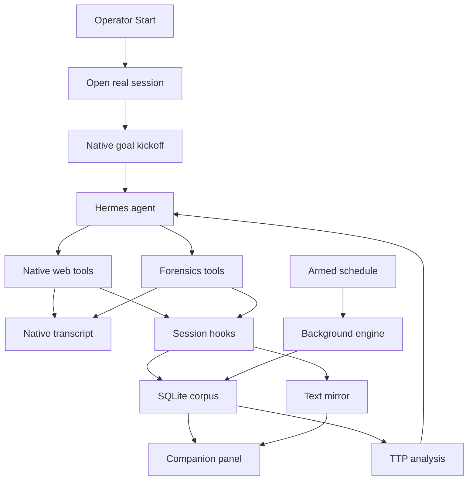

# PLAN3: Hackathon Readiness

Status: completed 2026-10-04.
All phases implemented and verified.
`make test`, `make lint`, and `make check` pass with zero errors.

## Goal

Ship a working, session-native Swarm Forensics demo.
Operators MUST see native tool calls in the hunt conversation.
Hermes MAY display reasoning supplied by the selected model.
The plugin MUST NOT fabricate reasoning or replay background logs as native tool calls.

## Key Decisions

- PLAN2 takes precedence over SPEC.md's worker-only architecture.
- Complete all PLAN2 features, including the companion panel and local mirror.
- Keep index access public-only. Defer keyed urlquery integration.
- The search builds the corpus. IOC lists, URL grammars, and n-grams seed discovery.
- Do not download incident corpora or AI Village datasets.
- Adapt TTP.md and HUNT.md to this growing web corpus.
- Keep background execution for scheduled and explicitly headless hunts.
- Do not modify Hermes core files or enable gateway message injection.
- Clean obsolete code during each phase, not after feature development.

## Resolved Blockers

| Priority | Item | Resolution |
|---|---|---|
| P0 | Session binding | Bound real Hermes session context in `command.py` and `ledger.py`. |
| P0 | Session attach | Attached sessions now store durable bindings and share tool context. |
| P0 | Session execution | Session-mode hunts do not spawn background worker threads. |
| P0 | Desktop launch | Launch helpers open durable sessions and bind hunt state. |
| P0 | Evidence attribution | Evidence and mirror tools resolve bound hunt IDs dynamically. |
| P0 | Lifecycle hooks | Registered pre-LLM, pre-tool, and post-tool lifecycle hooks. |
| P0 | UI components | Added composer underside strip and right companion pane. |
| P1 | TTP analysis | Added deterministic URL, relay, and nonce analysis. |
| P1 | Local mirror | Added content-addressed text mirror with WAL persistence. |

## Mechanism

## Phase Status Summary

- [x] **Phase 0: Contract and Invariants.** Schema v5 migration, invariants in `MODULE.md`, and `SPEC.md` complete.
- [x] **Phase 1: Real Session Binding.** Removed fake session strings. Added persistent session bindings in `command.py` and `ledger.py`.
- [x] **Phase 2: Lifecycle Hooks and Tool Policy.** Added `hooks.py`. Injected fenced hunt context. Captured observations in `ledger.py`.
- [x] **Phase 3: Growing Corpus and TTP Analysis.** Added `analysis.py` with URL normalization, nested relays, and nonce parsing. Seeded `hunt_brief` from `TTP.md`.
- [x] **Phase 4: Safe Local Mirror.** Added `mirror.py` with content-addressed disk storage, size caps, and safety screening.
- [x] **Phase 5: Companion Panel and Desktop UI.** Registered composer underside strip and companion pane in `desktop/plugin.js`. Added backend routes in `dashboard/plugin_api.py`.
- [x] **Phase 6: Cleanup and Delivery.** Removed `legacy.py`, `PLAN.md`, `PLAN2.md`, and `TODO.md`. Updated `MODULE.md` and `SKILL.md`.

## Verification Results

- `make test`: 130 offline Python unit tests and 31 JS render tests passed.
- `make lint`: 100-character line length check passed across all files.
- `make check`: manifest assertion, compilation, and Node.js module check passed.
