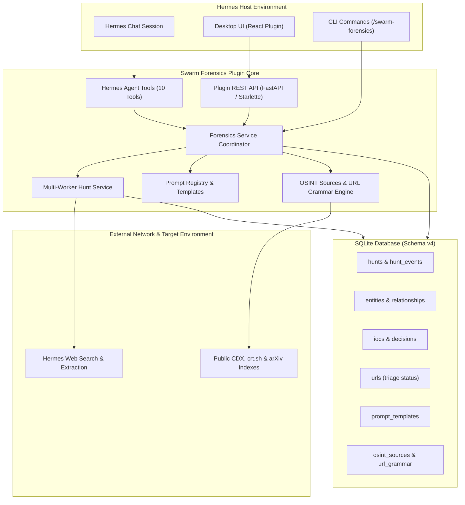

# Swarm Forensics (Hermes plugin)

An autonomous swarm hunter for Hermes desktop. An operator starts a hunt.
Hermes then searches the public web for agent traces until the operator
stops it. The plugin keeps what it finds in a local SQLite database:
events, evidence, IOCs, and an Obsidian-style graph of agents, swarms, and
cases.

## Install

From a checkout of this repository:

```
make hermes-install      # from the repository root
make install             # from pug-research/hermes-plugin
```

The target copies `plugins/swarm-forensics` into the Hermes home and runs
`hermes plugins enable swarm-forensics`. It picks the Hermes home in this
order: `HERMES_HOME`, the Windows desktop app (under WSL), then `~/.hermes`.
Restart the Hermes desktop app afterward so the backend routes mount.

```
HERMES_HOME=/path/to/hermes make hermes-install   # explicit target
make hermes-uninstall                             # keeps the database
```

You can also use this [one-click install link](https://tinyurl.com/swarm-forensics) or the URI below in the Hermes desktop app:

```
hermes://plugin/install?repo=christopherwoodall/swarm-forensics/pug-research/hermes-plugin/plugins/swarm-forensics&enable=1
```

## Use

Open **Swarm Forensics** in the desktop app, or use the command:

| Command | Effect |
|---|---|
| `/swarm-forensics start [goal]` | Start an autonomous hunt. It runs until you stop it. |
| `/swarm-forensics session [goal]` | Start an interactive hunt session in Hermes chat. |
| `/swarm-forensics attach [id]` | Attach current chat session to a hunt for live steering. |
| `/swarm-forensics subhunt [parent_id] [goal]` | Spawn a concurrent child hunt up to depth limit. |
| `/swarm-forensics tools [id] [n]` | Inspect recent tool calls, queries, and model rationale. |
| `/swarm-forensics pause [id]`, `resume [id]`, `stop [id]` | Control hunts and active sub-hunts. |
| `/swarm-forensics status` | Show hunt state and totals. |
| `/swarm-forensics log [n]` | Show recent hunt events and activities. |
| `/swarm-forensics review` | List proposed IOC terms awaiting decision. |
| `/swarm-forensics accept <id> [reason]`, `reject <id> [reason]` | Accept or reject a proposed IOC. |
| `/swarm-forensics benign <id\|term> [reason]` | Mark an indicator as a benign false positive. |
| `/swarm-forensics narrow <id> <term>` | Narrow an indicator term. |
| `/swarm-forensics find <text>` | Search artifacts, agents, swarms, and campaigns. |
| `/swarm-forensics settings [key [value]]` | Read or update configuration settings. |
| `/swarm-forensics reset [--force]` | Wipe all data and start fresh from scratch. |

Interactive Hermes tools:
- `sf_get_context`, `sf_search_index`, `sf_record_evidence`, `sf_propose_ioc`, `sf_manage_entity`, `sf_link_entities`, `sf_triage_item`, `sf_query_knowledge`, `sf_spawn_subhunt`, `sf_attach_hunt`.

Desktop pages:
- **Hunt**: Activity log with filters, active leads with dismiss actions, recursive sub-hunt tree view, `+ Sub-hunt` spawner, live discovered URLs feed with `+ Artifact` capture, attach command helper, and interactive hunt session card.
- **Knowledge**: Interactive graph, hierarchy browser (*Belongs to* and *Contains*), custom groups (`+ Group`), tags, and Markdown notes.
- **Evidence**: Captured page excerpts with provenance and taint indicators.
- **IOCs**: Indicator catalog, promotion policy status, decision audit logs, and benign triage.
- **URLs**: Discovered and predicted URL catalog, filtering by status, benign/suspicious triage, and `+ Artifact` capture.
- **Prompts**: Database-backed prompt templates, token placeholder chips (`{{var}}`), reset to defaults, and JSON export/import.
- **Sources**: Index source enable toggles (Wayback CDX, crt.sh, arXiv Intelligence), candidate URL grammar rules, and wordlist import.
- **Settings**: Plugin configuration (depth limits, multi-hunt concurrency), schedule controls, full data export bundle, and Danger Zone reset.

## Architecture



## How a hunt works

Each cycle runs these steps. The loop repeats until the operator stops it.

1. **Plan.** Hermes proposes search queries from past findings and open leads.
2. **Search.** The plugin runs queries through Hermes `web_search` and
   enabled public indexes.
3. **Read.** Hermes `web_extract` reads promising pages.
4. **Analyze.** The model proposes entities, links, IOC terms, and new leads.
5. **Record.** The plugin writes evidence, entities, and proposals to the
   database. New leads feed the next cycle.

## Safety model

- The model proposes. Policy and the operator decide.
- Fetched text is untrusted. The plugin fences it and screens it for
  injection phrasing. Tainted evidence never supports an IOC promotion.
- IOC promotion is `manual` by default. `automatic` mode needs minimum
  evidence, distinct hosts, claim level, and a daily cap. Every change is
  audited.
- Entities enforce strict hierarchy: `artifact -> agent -> swarm -> campaign`.
  Links of kind `part_of` must point from child to parent.
- Schedules are off. The operator arms each one. Scheduled hunts run only
  while the desktop app is open.
- A hunt stops when the app closes. After a restart a hunt is `paused`, and
  the operator resumes it.
- Index sources use dynamic allowlisting from enabled database records.
  Credentials are redacted before any write.
- Scope is agents and public evidence. No operator attribution.

## Data & Export

The database lives at `<hermes home>/swarm-forensics/swarm-forensics.db`.
Override the folder with `SWARM_FORENSICS_STATE_DIR`. State from the first
(CLI) version is imported once, read-only.

Operators can export data through the Settings tab or palette command:
- Generates `swarm-forensics.json` streaming dump (schema v3 with prompts, URLs, and entity tags).
- Generates an Obsidian Markdown vault with `[[wikilinks]]` in `exports/vault/`.

## Develop

```
make hermes-test     # offline tests, synthetic data, no network or model
make hermes-lint
make hermes-check    # package structure, manifests, Python and JS syntax
```

Detailed technical specification is in [SPEC.md](SPEC.md).
Architecture, interfaces, and invariants are in [MODULE.md](MODULE.md).
