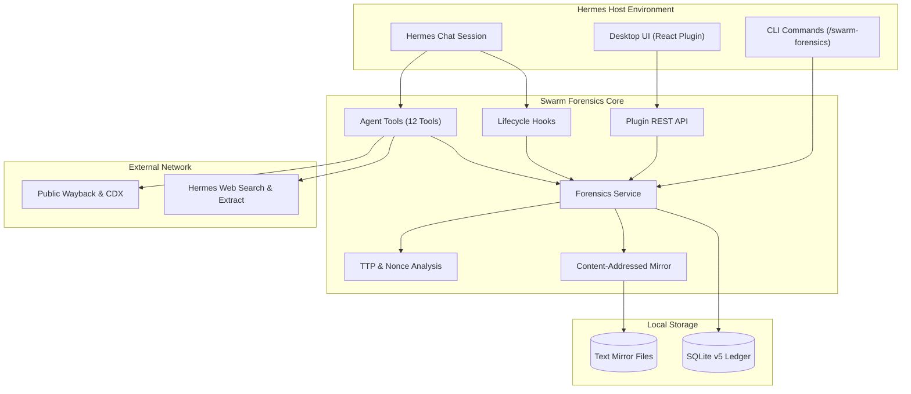

# Swarm Forensics (Hermes Plugin)

Autonomous and interactive swarm threat intelligence for Hermes Desktop and CLI.
The plugin searches public web sources for agent infrastructure and behavioral traces.
It writes events, evidence, indicators of compromise (IOCs), and entities to a local SQLite database.



---

## Quick Start

Get started in three steps.

### 1. Install the Plugin

From the repository root:

```bash
make hermes-install
```

Or install from inside this directory:

```bash
make install
```

The installer copies plugin files into your Hermes home directory.
Restart the Hermes desktop app after installation.

### 2. Start a Hunt

Open Hermes chat and enter:

```text
/swarm-forensics start Find agent infrastructure and relay patterns
```

This starts a session-native hunt.
The chat agent runs the hunt in your conversation.
You see native tool calls and model reasoning in real time.

To run an autonomous background worker instead, schedule a hunt or run in headless mode.

### 3. Observe and Steer

- **Chat**: Read live tool arguments and model thoughts. Steer the hunt with normal chat messages.
- **Composer Strip**: Look below the message composer for live hunt status and metrics.
- **Companion Pane**: Look at the right sidebar for discovered URLs, captured artifacts, and tool logs.
- **Desktop Page**: Open the **Swarm Forensics** app tab for the full database workbench.

---

## Core Capabilities

### 1. Session-Native Execution
Session hunts execute directly in your active Hermes chat.
Hermes invokes native search and forensics tools.
The plugin captures every observation into the SQLite ledger without replaying logs.

### 2. Desktop Companion Pane & Composer Strip
The composer underside strip displays current hunt status, cycle count, and active lead totals.
The right companion pane streams newly discovered URLs in real time.
Operators can promote any URL to an artifact entity with one click.

### 3. Content-Addressed Text Mirror
The plugin mirrors clean text from `web_extract` into `<state_dir>/mirror/`.
Files use SHA-256 hashes for deduplication.
The mirror enforces size caps and screens content for prompt injection before storage.

### 4. Deterministic TTP Analysis
The analysis engine normalizes URLs and unwraps nested relay chains (`r.jina.ai`, `allorigins`, `jqp`).
It matches nonce parameter grammars (`zz=oai`, `zzbulk`, `prepnonce`).
It classifies archive actions into create versus read operations.

### 5. Recursive Sub-Hunts
Hunts can spawn child crawler hunts to follow specific leads.
Sub-hunts respect a maximum depth limit (default 3) and parent-child tracking.
Stopping a parent hunt cancels all of its active child hunts immediately.

### 6. Database Prompt Workbench
All hunt prompts live in SQLite.
Operators can edit templates, insert dynamic token chips, and export prompt bundles.
Resetting any template restores its immutable default text.

### 7. Safe Indicator Lifecycle
IOC promotion defaults to manual operator review.
Items marked `benign` act as negative filters.
The engine never searches or queries benign URLs or indicator terms.

---

## Command Reference

Run `/swarm-forensics <subcommand>` in Hermes:

| Subcommand | Syntax | Description |
|---|---|---|
| `start` | `/swarm-forensics start [goal]` | Start a hunt. Binds active chat session automatically. |
| `attach` | `/swarm-forensics attach [id]` | Bind current chat session to a running hunt. |
| `subhunt` | `/swarm-forensics subhunt <goal> [parent_id]` | Spawn a recursive child crawler hunt. |
| `tools` | `/swarm-forensics tools [id] [n]` | Inspect recent tool calls and queries. |
| `pause` | `/swarm-forensics pause [id]` | Pause an active hunt. |
| `resume` | `/swarm-forensics resume [id]` | Resume a paused hunt. |
| `stop` | `/swarm-forensics stop [id]` | Stop a hunt and its child sub-hunts. |
| `status` | `/swarm-forensics status` | Show active hunt metrics and database totals. |
| `log` | `/swarm-forensics log [n]` | Display recent hunt activity events. |
| `review` | `/swarm-forensics review` | List proposed IOC terms awaiting decision. |
| `accept` | `/swarm-forensics accept <id> [reason]` | Accept a proposed IOC term. |
| `reject` | `/swarm-forensics reject <id> [reason]` | Reject a proposed IOC term. |
| `benign` | `/swarm-forensics benign <id\|term> [reason]` | Mark an indicator or URL as benign. |
| `narrow` | `/swarm-forensics narrow <id> <term>` | Narrow an indicator term. |
| `find` | `/swarm-forensics find <text>` | Search entities, artifacts, and campaigns. |
| `settings` | `/swarm-forensics settings [key [value]]` | Read or change configuration settings. |
| `reset` | `/swarm-forensics reset [--force]` | Wipe database and restore clean defaults. |

---

## Interactive Agent Tools

Hermes agents use twelve native forensics tools:

1. `sf_get_context`: Inspect current hunt state, indicators, open leads, and allowlists.
2. `sf_search_index`: Query enabled public index adapters (CDX, Wayback, Arquivo).
3. `sf_record_evidence`: Record analyzed page excerpts with provenance and claim level.
4. `sf_mirror_url`: Mirror clean page text into the local content-addressed text store.
5. `sf_analyze_corpus`: Analyze URL grammars, relays, and nonce tokens against the corpus.
6. `sf_propose_ioc`: Submit candidate indicator terms for analyst review.
7. `sf_manage_entity`: Create or update artifacts, agents, swarms, and campaigns.
8. `sf_link_entities`: Link entities with hierarchical or loose relationships.
9. `sf_triage_item`: Mark URLs or indicators as benign, suspicious, or examined.
10. `sf_query_knowledge`: Search across entities, indicators, URLs, and evidence text.
11. `sf_spawn_subhunt`: Spawn recursive child crawler hunts up to configured max depth.
12. `sf_attach_hunt`: Bind the current conversation context to an active hunt.

---

## Desktop User Interface

The desktop UI provides eight primary tabs, a composer strip, and a side panel:

- **Hunt Tab**: Real-time event log, lead management, sub-hunt hierarchy, and URL feed.
- **Knowledge Tab**: Interactive entity graph, hierarchy browser, custom groups, and Markdown notes.
- **Evidence Tab**: Captured page excerpts with provenance, timestamps, and taint status.
- **IOCs Tab**: Indicator catalog, promotion policy status, and decision audit logs.
- **URLs Tab**: Discovered URL catalog with triage buttons and one-click artifact capture.
- **Prompts Tab**: Database-backed template editor with token chips and reset controls.
- **Sources Tab**: Index adapter toggles, candidate URL grammars, and wordlist imports.
- **Settings Tab**: Configuration limits, schedule controls, JSON export, and data reset.
- **Composer Underside Strip**: Compact status widget embedded below the message input box.
- **Right Companion Pane**: Collapsible sidebar displaying live URLs, mirror files, and tool logs.

All cards and monospaced text blocks in the desktop interface support text selection and copying.

---

## Epistemic Rules & Safety

1. **Model Proposes, Policy Decides**: The model generates hypotheses. Policy code and human operators validate them.
2. **Untrusted Content Fencing**: External web text is untrusted. The plugin fences all retrieved text before prompt injection.
3. **Taint Screening**: Evidence containing prompt injection signatures is flagged as tainted. Tainted evidence cannot promote IOCs.
4. **Claim Ladder Discipline**: Analysts MUST use claim rungs from `L1` (artifact) to `L5` (operation).
5. **No Human Attribution**: Scope covers agent software and infrastructure only. Never attribute actions to humans.
6. **Negative Filtering**: Benign indicators and URLs prevent redundant or unwanted searches.

---

## Data Storage & Export

- **Database**: `<hermes home>/swarm-forensics/swarm-forensics.db` (SQLite Schema v5 with WAL).
- **Text Mirror**: `<hermes home>/swarm-forensics/mirror/<sha256>.txt`.
- **Environment Override**: Set `SWARM_FORENSICS_STATE_DIR` to use a custom data directory.
- **JSON Export**: Settings page generates a complete streaming data dump.
- **Obsidian Vault**: Settings page exports entities and notes with `[[wikilinks]]`.

---

## Verification & Testing

Run all quality checks through the root Makefile:

```bash
make test    # Runs 130 Python unit tests and 31 Node.js render tests
make lint    # Runs Ruff lint checks (100 character line length)
make check   # Validates package manifests, Python compilation, and ESM syntax
```

Detailed technical specification is in [SPEC.md](SPEC.md).
Architecture, interfaces, and invariants are in [MODULE.md](MODULE.md).
Operational hunt playbooks are in [HUNT.md](HUNT.md) and [TTP.md](TTP.md).
