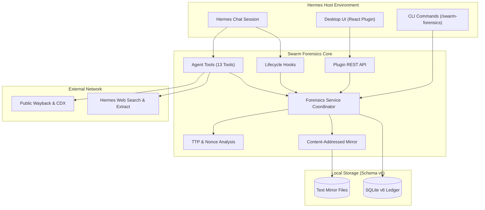
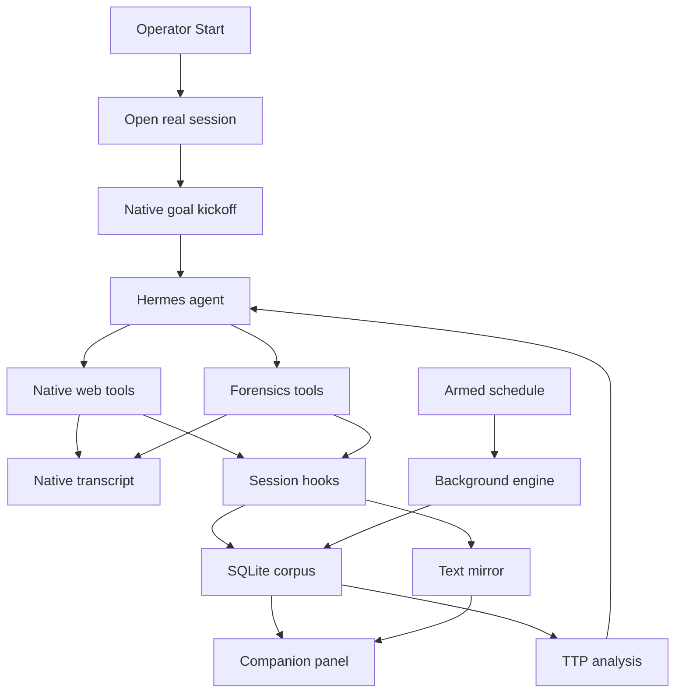

<div align="center">

# Swarm Forensics

**Autonomous and interactive swarm threat intelligence for Hermes Desktop and CLI.**

[](MODULE.md)
[](../../LICENSE)
[](#verification--testing)
[](#quick-start)

[Demo Video](https://github.com/user-attachments/assets/389dd157-1853-4faf-97cb-d3f6c967f6f4)

</div>

**Chat quiet after install or update? Re-apply the one-time consent: `hermes config set plugins.entries.swarm-forensics.allow_gateway_injection true`, then restart Hermes. Hunts keep running without it, but chat stays silent.**

The plugin searches public web sources for agent infrastructure and behavioral traces.
It writes events, evidence, indicators of compromise (IOCs), entities, and mirrors to SQLite.

- **Hunt in chat or in the background.** Run a session-native hunt with live tool calls, or schedule autonomous worker sweeps.
- **Watch it think.** The plugin posts batched hunt digests and idle nudges directly into your chat.
- **Steer from anywhere.** Slash commands, a composer status strip, a companion pane, and a full desktop workbench.
- **Trust the ledger.** Every query, tool call, and verdict lands in a local SQLite corpus with provenance.



## Contents

- [Quick Start](#quick-start)
- [Architecture & Concurrency Model](#architecture--concurrency-model)
- [Desktop User Interface](#desktop-user-interface)
- [Command Reference](#command-reference)
- [Interactive Agent Tools](#interactive-agent-tools)
- [Data Model & Storage Specification](#data-model--storage-specification)
- [TTP Playbook & Analytical Methodology](#ttp-playbook--analytical-methodology)
- [Hunt Playbook: Report-Seeded Investigations](#hunt-playbook-report-seeded-investigations)
- [Epistemic Rules & Claim Ladder](#epistemic-rules--claim-ladder)
- [Data Export & Obsidian Vault](#data-export--obsidian-vault)
- [Verification & Testing](#verification--testing)

---

## Quick Start

Get started in three steps.

### 1. Install the Plugin

**One click (recommended):** use the [install link](https://tinyurl.com/swarm-forensics-plugin),
or paste this URI directly into Hermes desktop:

```text
hermes://plugin/install?repo=christopherwoodall/swarm-forensics/showcase/hermes-plugin/plugins/swarm-forensics&enable=1
```

**From source:** run `make hermes-install` from the repository root, or `make install` from inside this directory.

Restart the Hermes desktop app after installation.

> [!IMPORTANT]
> Chat updates require a one-time consent. The source installer writes
> `plugins.entries.swarm-forensics.allow_gateway_injection: true` into the Hermes
> config. The one-click link cannot grant this consent; Hermes reserves it for an
> explicit operator act. After a one-click install, run
> `hermes config set plugins.entries.swarm-forensics.allow_gateway_injection true`
> once, or add the YAML by hand. Without it, hunts still run, but chat stays silent
> and the UI shows a "chat updates off" hint.

### 2. Start a Hunt

Open Hermes chat and enter:

```text
/swarm-forensics start Find agent infrastructure and relay patterns based on the following [Transluce report](https://transluce.org/agent-activity) on the urlquery.net website.
```

This command starts a session-native hunt.
The chat agent runs the hunt in your conversation.
You see native tool calls and model reasoning in real time.

To run an autonomous background worker instead, schedule a hunt or use headless mode.

### 3. Observe and Steer

- **Chat**: Read live tool arguments and model thoughts. Steer the hunt with normal chat messages. The plugin also posts batched hunt digests (milestones, tool calls, rationale) into the chat, and nudges an idle session hunt to continue. Tune with `narrate.enabled`, `narrate.min_interval_seconds`, and `narrate.drive_idle_seconds`.
- **Composer Strip**: Look below the message composer for live hunt status and metrics.
- **Companion Pane**: Look at the right sidebar for discovered URLs, captured artifacts, and tool logs.
- **Desktop Page**: Open the **Swarm Forensics** app tab for the full database workbench.

---

## Discover Patterns from Raw Data

Open the Morphologies tab and select an operator-authorized dataset path.
Optional JSON Pointer mappings identify content, actor, artifact, operation, and time fields.
Enable excerpt authorization before running the morphology hunter.
The desktop run scans at most 10,000 records and uses four model rounds.

The model selects probes from observed examples, not a predefined mechanism list.
Measured matches and contrasting records can guide further probes.
Discovery supports JSONL, NDJSON, CSV, and gzip variants.
Sequences require operation and grouping fields.
JSON arrays and parquet are unsupported.

Reset cancels persistence from in-flight discovery. Concurrent reviews preserve audit transition order.
CLI reports MUST NOT overwrite dataset files, including symlink and hardlink aliases.

Inspect measurements without exposing excerpts to the model:

```bash
make hermes-hunter ARGS='/path/to/authorized.jsonl.gz --survey-only --max-records 1000'
```

Run bounded model discovery with explicit authorization:

```bash
make hermes-hunter ARGS='/path/to/authorized.jsonl.gz --content-field /text --max-records 1000 --max-rounds 4 --allow-excerpts --output data/raw/morphology-hunter/report.json'
```

Discovery-generated cards retain deterministic descriptions, references, counts, and hashes.
Cards and saved reports MUST NOT retain source excerpts, probe literals, or model interpretations.
Fenced model interpretations remain in the current desktop view only.
CLI output excludes transient interpretations.
Programmatic callers MUST apply `durable_report` before persisting discovery results.
This boundary does not control host-model logging or anonymize source metadata.

Text recurrence remains `e0`. Recorded sequence recurrence MAY receive `e1`.
Neither establishes transmission, causality, maliciousness, or verified coordination.
Combined support across observations and novelty remain unknown.
Scan caps MUST NOT support full-corpus absence claims.
Sequence shortlists are frequency-capped before null comparison.
Final-round probe requests can execute without another feedback round.

The desktop API imports discovery-generated cards without starting investigative hunts or promoting IOCs.
Operators MAY also import external candidate cards through `POST /morphologies`.
External cards follow the broader untrusted receiver contract and MAY include redacted excerpts.
Review status tracks workflow; `resolved` does not establish a verified morphology.

Investigators can retrieve cards with `sf_get_morphology_candidates`.
Set `field` to `source_provenance` or `missing_evidence` when needed.
Field selectors MUST name required card fields. Retrieve optional fields through full-card paging.
Follow zero-based `page` and `next_page` until `has_more` is false.
Each returned page remains fenced as untrusted data.
Sanitization precedes JSON serialization. Fence-marker neutralization precedes page slicing.

---

## Architecture & Concurrency Model

The system supports two hunt execution modes:

1. **Session-Native Mode**:
   - The hunt executes directly within an active Hermes chat session.
   - Hermes invokes web search, web extract, and `sf_*` tools natively.
   - Operators observe genuine tool calls and model reasoning in the chat window.
   - Lifecycle hooks record every tool call and query into the local corpus ledger.
   - Operators steer the investigation through regular conversational prompts.

2. **Background Worker Mode**:
   - Dedicated worker threads run scheduled hunts and headless background sweeps.
   - Background hunts poll enabled public indexes and run autonomous analysis cycles.
   - Background hunts stop automatically when the desktop heartbeat lapses.



### Concurrency Rules

- Multiple hunts MAY run at once, up to `hunt.max_active_hunts` (default 3).
- Each chat session follows its own hunt; session-less verbs (`stop`, `status`, `log`) target the bound hunt of the calling session.
- A hunt MUST respect configured cycle limits.
- Child sub-hunts inherit the session identifier and root trace context of their parent.
- The system limits sub-hunt depth to three levels by default.
- Stopping a parent hunt MUST stop all active child hunts immediately.
- When the host application closes, all active workers transition to paused state.
- Workers MUST NOT resume automatically after process restart without operator action.

---

## Desktop User Interface

The desktop UI provides nine tabs, an input strip, and a side companion panel:

- **Hunt Tab**: Real-time event log, lead management, sub-hunt hierarchy, and URL feed.
- **Knowledge Tab**: Interactive entity graph, hierarchy browser, custom groups, and Markdown notes.
- **Morphologies Tab**: Discover patterns from authorized raw data, import hypotheses, and inspect measurements and provenance.
- **Evidence Tab**: Captured page excerpts with provenance, timestamps, and taint status.
- **IOCs Tab**: Indicator catalog, promotion policy status, and decision audit logs.
- **URLs Tab**: Discovered URL catalog with triage buttons and one-click artifact capture.
- **Prompts Tab**: Database-backed template editor with token chips and reset controls.
- **Sources Tab**: Index adapter toggles, candidate URL grammars, and wordlist imports.
- **Settings Tab**: Configuration limits, schedule controls, JSON export, and data reset.
- **Composer Underside Strip**: Compact status widget embedded below the message input box.
- **Right Companion Pane**: Collapsible sidebar displaying live URLs, mirror files, and tool logs.

All cards and monospaced text blocks in the desktop interface support text selection and copying.

---

## Command Reference

Run `/swarm-forensics <subcommand>` in Hermes:

| Subcommand | Syntax | Description |
|---|---|---|
| `start` | `/swarm-forensics start [goal]` | Start a hunt. Binds active chat session automatically. |
| `attach` | `/swarm-forensics attach [id]` | Bind current chat session to an active hunt. |
| `subhunt` | `/swarm-forensics subhunt <goal> [parent_id]` | Spawn a recursive child crawler hunt. |
| `tools` | `/swarm-forensics tools [id] [n]` | Inspect recent tool calls and queries. |
| `pause` | `/swarm-forensics pause [id]` | Pause an active hunt. |
| `resume` | `/swarm-forensics resume [id]` | Resume a paused hunt. |
| `stop` | `/swarm-forensics stop [id\|all]` | Stop this session's hunt, one id, or every hunt. |
| `status` | `/swarm-forensics status` | Show hunt metrics and totals (this session's hunt first). |
| `log` | `/swarm-forensics log [id] [n]` | Display recent hunt activity events. |
| `review` | `/swarm-forensics review` | List proposed IOC terms awaiting decision. |
| `accept` | `/swarm-forensics accept <id> [reason]` | Accept a proposed IOC term. |
| `reject` | `/swarm-forensics reject <id> [reason]` | Reject a proposed IOC term. |
| `benign` | `/swarm-forensics benign <id\|term> [reason]` | Mark an indicator or URL as benign. |
| `narrow` | `/swarm-forensics narrow <id> <term>` | Narrow an indicator term. |
| `find` | `/swarm-forensics find <text>` | Search entities, artifacts, and campaigns. |
| `settings` | `/swarm-forensics settings [key [value]]` | Read or change configuration settings. |
| `reset` | `/swarm-forensics reset [--force]` | Wipe database and restore clean defaults. |

---

## Interactive Agent Tools

Hermes agents use thirteen native forensics tools:

1. `sf_get_context`: Inspect current hunt state, indicators, open leads, and allowlists.
2. `sf_search_index`: Query enabled public index adapters (CDX, Wayback, Arquivo).
3. `sf_record_evidence`: Record analyzed page excerpts with provenance and claim level.
4. `sf_mirror_url`: Mirror clean page text into the local content-addressed text store.
5. `sf_analyze_corpus`: Analyze URL grammars, relays, and nonce tokens against the corpus.
6. `sf_propose_ioc`: Submit candidate indicator terms for analyst review.
7. `sf_manage_entity`: Create or update artifacts, agents, swarms, and campaigns.
8. `sf_link_entities`: Link entities with hierarchical or loose relationships.
9. `sf_triage_item`: Mark URLs or indicators as benign, suspicious, or examined.
10. `sf_query_knowledge`: Search across entities, indicators, URLs, and evidence text.
11. `sf_spawn_subhunt`: Spawn recursive child crawler hunts up to configured max depth.
12. `sf_attach_hunt`: Bind the current conversation context to an active hunt.
13. `sf_get_morphology_candidates`: Retrieve fenced candidate cards with optional field selection and paging.

All tools sanitize arguments and return structured JSON objects.

---

## Data Model & Storage Specification

Operational state lives in SQLite under `<hermes home>/swarm-forensics/swarm-forensics.db`.
The database operates with write-ahead logging enabled (Schema v6).

### 1. Database Schema
Schema tables include:
- `hunts`: Hunt records with origin (`session` or `worker`), state, goal, and depth.
- `hunt_events`: Chronological event audit log for actions, findings, and errors.
- `session_bindings`: Durable mapping between Hermes chat sessions and hunt IDs.
- `corpus_observations`: Web queries, tool calls, and result URLs captured by hooks.
- `entities` & `entity_links`: Graph nodes and directed relationships.
- `iocs` & `ioc_decisions`: Indicators, lifecycle status, and human review decisions.
- `urls`: Discovered URLs with triage states (`discovered`, `examined`, `benign`, `suspicious`).
- `prompt_templates`: Editable prompt templates with variable token substitution (`{{var}}`).
- `osint_sources` & `url_grammar`: Configured public indexes and URL permutation rules.
- `mirrors`: Metadata catalog for locally mirrored text files.
- `morphology_candidates` & `morphology_candidate_log`: Imported hypotheses and audited review transitions.

Migration 6 appends morphology storage. Migration 5 preserves session bindings, corpus observations, and mirrors.

### 2. Entity Hierarchy
Entities enforce a strict hierarchy:
`artifact -> agent -> swarm -> campaign`

- Links of kind `part_of` MUST point from child to parent.
- The system supports custom agent and swarm groups.
- Entities support user-defined tags and confidence ratings.
- Loose links (`tagged_with`, `associated_with`, `attributed_to`) connect entities flexibly.

### 3. Indicator Lifecycle
- IOC categories include `domain`, `ip`, `agent_hash`, `prompt_signature`, and `nonce_grammar`.
- Indicator states: `proposed`, `active`, `inactive`, `rejected`, or `benign`.
- Promotion to `active` defaults to manual operator review.
- Automatic promotion requires distinct host evidence and untainted records.
- Indicators marked `benign` act as negative filters.
- The engine NEVER queries benign terms or URLs.

### 4. Content-Addressed Text Mirror
- Mirrored content MUST originate from clean text extracts.
- The system screens content for prompt injection before writing to disk.
- Mirrored text files live under `<state_dir>/mirror/<sha256>.txt`.
- The system enforces configurable file and total directory byte limits.
- Reset operations wipe mirrored files along with database tables.

### 5. Data Reset Mechanism
- Operators can wipe all data via `POST /reset` or `/swarm-forensics reset --force`.
- The reset operation terminates active workers before deleting data.
- The reset drops tables, re-runs migrations, and re-seeds clean defaults.

---

## TTP Playbook & Analytical Methodology

Forensics analysts follow eight tactics, techniques, and procedures (TTPs):

### TTP-1: Stratified URL Mining
Stream large dataset files line by line using streaming readers.
Extract URLs with regular expressions.
Normalize URLs to registrable domains.
Intersect domain lists across populations to identify shared infrastructure.

### TTP-2: Relay-Chain Grammar
Decompose nested proxy and relay chains for each target URL.
Observe nesting order: jq proxies outermost, CORS relays middle, target innermost.
Known relays include `r.jina.ai`, `allorigins`, `corsproxy.io`, `da.gd`, and `jqp.vercel.app`.
Known markdown proxies include `md.succ.ai`, `pure.md`, and `markdown.new`.

### TTP-3: Nonce Grammar
Match query parameter structures rather than specific values.
Detect parameter families such as `zz=oai<digits>`, `zzbulk`, and `prepnonce`.
Detect bare epoch integers and `oai*` tags.
Count occurrences per corpus layer to identify population signatures.

### TTP-4: Archive-First Behavior
Search for capture creation endpoints including `web.archive.org/save/` and `arquivo.pt`.
Identify retry and delay loops surrounding archive requests.
Distinguish creating archive captures from reading existing captures.
Capture creation provides a stronger behavioral signal than reading.

### TTP-5: Basin Grading
Grade shared domains and URLs across five distinct categories:
1. **Exact URL**: Identical scheme, host, path, and normalized query parameters.
2. **Domain and Path**: Matching host and stable path with differing queries.
3. **Target Host**: Matching destination service.
4. **Service Basin**: Related hosts within public organizational domains.
5. **Temporal**: Observed hits bounded within the incident time window.

### TTP-6: Trace Pulling & Verification
Retrieve corroborating traces time-boxed to the target activity window.
Query public Wayback CDX indexes and Arquivo endpoints.
Record verdicts for every queried URL.
Log zero-hit queries as verified clean negatives.

### TTP-7: Tokenization Hygiene
Use n-grams and character chunks rather than word splits.
Normalize camel case, digit-letter boundaries, and percent encoding before comparison.
Quarantine contaminated partitions with documented reasons.
Never drop data partitions silently.

### TTP-8: Functional Matching
Compare equivalent communication channels: chat to chat, code to code, traces to traces.
Never compare conversational text against raw URL dumps.
Document the match rationale for every compared pair.

---

## Hunt Playbook: Report-Seeded Investigations

This playbook defines the operational procedure for report-seeded investigations.
Agents receive this prompt template when investigating report-seeded infrastructure.
Operators can load, customize, or reset this prompt in the Prompts tab.

### 1. Kickoff
Review the target incident report to identify candidate entry points.
Extract timestamped records of URLs, hosts, and response metadata.
Use these entries to seed searches for shared infrastructure and nonce grammars.

### 2. Investigation Steps
1. **Extract Indicators**:
   Extract every indicator of compromise from the report.
   Capture URLs, domains, URL patterns, parameter shapes, and relay hosts.
   Capture file paths, archive actions, and filter evasion claims.

2. **Verify Indicators Locally**:
   Cross-reference each indicator against available corpora and public indexes.
   Classify each indicator into one category:
   - **Confirmed**: Present with matching structure, cite counts, and timestamps.
   - **Commodity**: Present but generic public infrastructure.
   - **Quotation**: Present only in commentary discussing the incident after publication.
   - **Absent**: Clean negative result within recorded search parameters.

3. **Expand Beyond the Seed Report**:
   The initial report is a seed, not a boundary.
   Search the corpus for indicators that the report missed.
   Identify unmentioned relay hosts and nesting patterns in proxied URLs.
   Detect archive-creation actions, parameter nonce grammars, and co-occurring domains.

4. **Grade Relationships**:
   Grade every relationship on the standard scale:
   - **Shared**: Same artifact across two or more layers.
   - **Linkage**: Artifact supported by corroborating evidence.
   - **Correlation**: Statistical co-occurrence only.
   Shared destinations that research agents routinely query are gravity wells, not linkage.

### 3. Report Output Structure
- **Per-IOC Verdict Table**: Include evidence, counts, and classification for each indicator.
- **Novel Findings**: Document discoveries that the seed report missed, with reproduction steps.
- **Clean Negatives**: List the three cleanest negative search results with exact queries.
- **Synthesis Paragraph**: Summarize the strongest finding, strongest limitation, and operational unity.

---

## Epistemic Rules & Claim Ladder

1. **Model Proposes, Policy Decides**:
   The model generates hypotheses.
   Policy code and human operators validate them.

2. **Untrusted Content Fencing**:
   External web text is untrusted data.
   The plugin fences all retrieved text before prompt injection.

3. **Taint Screening**:
   Evidence containing prompt injection signatures is flagged as tainted.
   Tainted evidence CANNOT promote indicators of compromise.

4. **Relationship Grading Scale**:
   - **Sharing**: Same artifact across two or more layers.
   - **Linkage**: Artifact supported by corroborating evidence.
   - **Correlation**: Statistical co-occurrence only.
   Shared destinations on public data portals are gravity wells, not linkage.

5. **Claim Ladder Discipline**:
   Interpret every hit at the lowest supported rung:
   - **L1 Artifact**: Single URL carries agent-shaped grammar.
   - **L2 Burst**: Cadence and digest concentration indicate automated retrieval.
   - **L3 Task**: Selective parameter shape names target data.
   - **L4 Toolkit**: Relay stack, nonce grammar, and construction artifacts co-occur.
   - **L5 Operation**: Same task, window, and toolkit across venues.
   - **Never**: Operator identity. No rule reaches a human.

6. **No Human Attribution**:
   Scope covers agent software and infrastructure only.
   Never attribute actions to human operators.

---

## Data Export & Obsidian Vault

Operators can export data through the Settings tab or palette command:

- **JSON Export**: Streaming format v4 contains hunts, IOCs, URLs, entities, templates, morphology cards, and review history.
- **Obsidian Vault**: Exports entities and notes with `[[wikilinks]]` into `exports/vault/`.

---

## Verification & Testing

Treat the root `Makefile` as the single entry point:

```bash
make setup   # Installs declared plugin and Discord Swarm development dependencies
make test    # Runs maintained Python and JavaScript suites
make lint    # Runs Ruff lint checks (100 character line length)
make check   # Validates package manifests, Python compilation, and ESM syntax
make hermes-hunter-test
make hermes-hunter-ui-test
```

The plugin suite passes 189 Python tests and 39 JavaScript tests.
Desktop tests cover server rendering and a synthetic request handler, not live desktop interaction.

Architectural invariants and module decisions are documented in [MODULE.md](MODULE.md).
